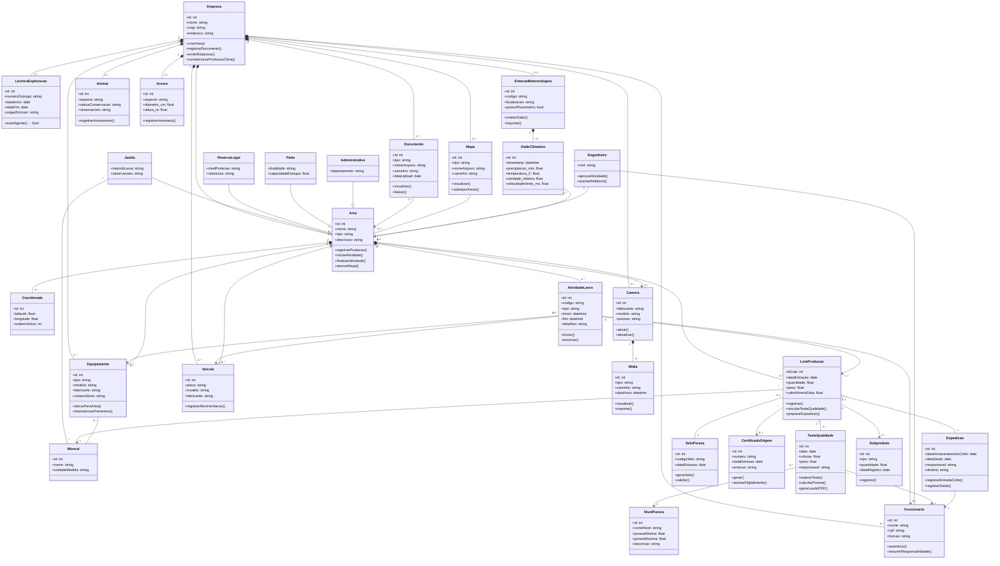
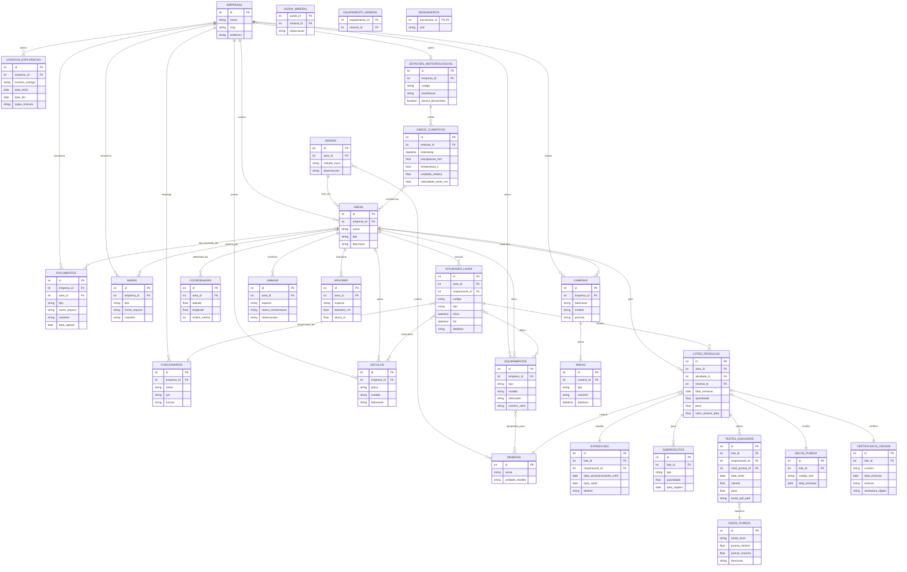
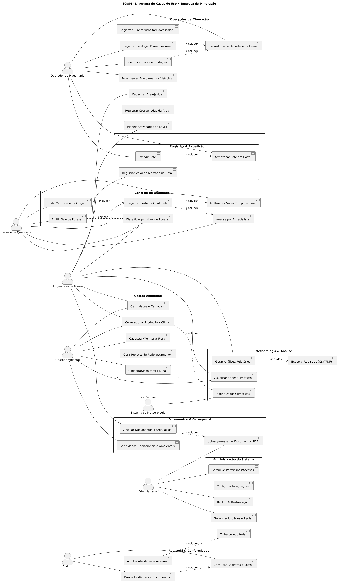

# Eng_Software_02.2025
Estudo Dirigido - Engenharia de Software

## - [1. Introdução](#1-introdução)
<!-- >>> Descrever a necessidade de um sistema nessa área em até 2 ou 3 parágrafos. -->

<!--  Função/Persona: Você é um consultor especialista em sistemas de gestão para a   indústria de mineração. Sua tarefa é redigir a introdução de uma proposta de projeto para o desenvolvimento de um Sistema de Gerenciamento de Operações de Mineração (SGOM). 
Objetivo: Elaborar uma introdução concisa, em 2 ou 3 parágrafos, que descreva a necessidade crítica de um sistema de informação integrado para uma empresa de mineração com operações complexas. A introdução deve contextualizar o leitor sobre os desafios do setor e justificar a importância da solução proposta. 
Instruções: No primeiro parágrafo, aborde a complexidade da operação, destacando como a diversidade de dados gerados (operacionais, ambientais, regulatórios) impõe desafios significativos à gestão, eficiência e conformidade. No parágrafo seguinte, justifique a necessidade de um sistema integrado como solução estratégica. Enfatize os ganhos em rastreabilidade, segurança da informação e a capacidade de correlacionar dados distintos (ex: produção vs. clima) para otimizar as operações e a tomada de decisão. Lembrando de utilizar como base o arquivo de Descrição_Empresa, que foi passado anteriormente. --> 
 
As operações de mineração apresentam uma complexidade única, resultado da diversidade de processos envolvidos e da variedade de dados que precisam ser monitorados e controlados. No caso desta empresa, que possui autorização para explorar ouro, casiterita, dolomito e zinco em diferentes jazidas, o volume de informações geradas é expressivo: registros de produção diária, qualidade dos lotes, controle ambiental (fauna, flora e áreas de preservação), dados climáticos provenientes de estação meteorológica, além de documentos regulatórios e de conformidade legal. A ausência de uma gestão integrada desses elementos cria desafios significativos para assegurar eficiência operacional, conformidade normativa e rastreabilidade em toda a cadeia produtiva.

Diante desse cenário, a implementação de um Sistema de Gerenciamento de Operações de Mineração (SGOM) surge como uma solução estratégica para unificar e correlacionar informações críticas. Um sistema integrado permitirá consolidar registros operacionais, ambientais e administrativos em uma única plataforma, assegurando maior segurança da informação e facilitando auditorias internas e externas. Além disso, a capacidade de relacionar dados de produção com variáveis climáticas e ambientais proporcionará análises preditivas e decisões mais assertivas, promovendo ganhos em eficiência, redução de riscos e otimização de recursos, fortalecendo assim a competitividade e a sustentabilidade da mineradora.

## - [2. Descrição](#2-descrição)
  - [2.1. Requisitos.](#21-requisitos)
>> Colocar aqui a lista acima!

<!-- 
    Prompt: Função/Persona: Você é um Analista de Requisitos Sênior. Sua principal habilidade é traduzir descrições de processos de negócio em requisitos de sistema claros, organizados e acionáveis.

Objetivo: Com base na descrição detalhada da empresa de mineração fornecida anteriormente, gerar uma lista completa de requisitos funcionais e não funcionais para o Sistema de Gerenciamento de Operações de Mineração (SGOM). O resultado deve ser um documento único, formatado em Markdown, pronto para ser usado pela equipe de desenvolvimento e gestão do projeto.

Instruções de Formatação e Conteúdo:

Formato Geral: O output deve ser inteiramente em Markdown.

Título Principal: Comece o documento com um título de primeiro nível, como # Requisitos do Sistema de Gerenciamento de Operações de Mineração (SGOM).

Estrutura em Módulos: Agrupe os requisitos em módulos lógicos para melhor organização. Utilize títulos de segundo nível (##) para cada módulo. Sugestões de módulos:

Gestão de Áreas e Produção

Controle de Atividades e Lavra

Gestão de Qualidade e Certificação

Logística, Expedição e Subprodutos

Monitoramento Ambiental e Sustentabilidade

Administração (Funcionários, Veículos e Equipamentos)

Gestão de Documentos e Dados Geoespaciais

Requisitos Não Funcionais

Lista de Requisitos: Dentro de cada módulo, liste os requisitos individuais utilizando a sintaxe de checklist do Markdown (- [ ]). Cada item deve descrever uma funcionalidade específica derivada do cenário.

Exemplo: - [ ] Permitir o cadastro de áreas com coordenadas delimitadoras, definindo seu tipo (ex: jazida, reserva legal, pátio).

Clareza e Rastreabilidade: Cada requisito deve ser conciso e corresponder diretamente a uma ou mais das 30 descrições fornecidas, garantindo que todas as necessidades do negócio sejam cobertas.

Requisitos Não Funcionais: Crie uma seção específica para requisitos que descrevem como o sistema deve operar, como armazenamento de arquivos, integração de dados e segurança.

Exemplo: - [ ] O sistema deve suportar o upload, armazenamento e visualização de arquivos no formato PDF.
-->

# Requisitos do Sistema de Gerenciamento de Operações de Mineração (SGOM)

| ID     | Módulo                                   | Requisito |
|--------|------------------------------------------|-----------|
| RF001  | Gestão de Áreas e Produção              | Permitir o cadastro de áreas com coordenadas delimitadoras, definindo seu tipo (jazida, reserva legal, pátio, área administrativa). |
| RF002  | Gestão de Áreas e Produção              | Registrar a licença de exploração da área, incluindo data de início e data final. |
| RF003  | Gestão de Áreas e Produção              | Cadastrar múltiplas jazidas, informando os minerais exploráveis (ouro, casiterita, dolomito, zinco). |
| RF004  | Gestão de Áreas e Produção              | Registrar produção diária de cada área, incluindo quantidade, data e tipo de mineral. |
| RF005  | Gestão de Áreas e Produção              | Controlar registros de valor de mercado do minério na data da produção. |
| RF006  | Gestão de Áreas e Produção              | Relacionar dados climáticos coletados com a produção de cada área. |
| RF007  | Gestão de Áreas e Produção              | Registrar produção de areia de cascalho como subproduto da mineração. |
| RF008  | Controle de Atividades e Lavra          | Permitir o cadastro de atividades de lavra (prospecção, avaliação de amostras, preparo de área, extração, filtragem, pesagem, testes de qualidade, registro de produção, expedição). |
| RF009  | Controle de Atividades e Lavra          | Registrar detalhes de cada atividade: código, responsável, data/hora de início e fim, área de execução. |
| RF010  | Controle de Atividades e Lavra          | Associar cada lote extraído a um identificador único, vinculado à atividade de extração. |
| RF011  | Controle de Atividades e Lavra          | Registrar informações detalhadas das operações de lavra: local, data, hora, responsável e descrição da operação. |
| RF012  | Controle de Atividades e Lavra          | Registrar a expedição final, incluindo o armazenamento em cofre e identificação do responsável. |
| RF013  | Gestão de Qualidade e Certificação      | Registrar testes de qualidade de cada lote, contendo código da área, responsável, data, volume e peso. |
| RF014  | Gestão de Qualidade e Certificação      | Definir e aplicar níveis de pureza dos minerais conforme tabela de padrões. |
| RF015  | Gestão de Qualidade e Certificação      | Emitir selo de pureza quando o lote atingir o padrão exigido. |
| RF016  | Gestão de Qualidade e Certificação      | Permitir análise de qualidade realizada por especialistas e por visão computacional. |
| RF017  | Gestão de Qualidade e Certificação      | Emitir certificados de origem e de nível de pureza dos materiais comercializados. |
| RF018  | Logística, Expedição e Subprodutos      | Cadastrar os tipos de equipamentos específicos para extração e transporte de cada mineral. |
| RF019  | Logística, Expedição e Subprodutos      | Registrar movimentação de veículos e equipamentos durante as operações. |
| RF020  | Logística, Expedição e Subprodutos      | Gerenciar subprodutos da mineração, como areia e cascalho, incluindo volume de produção e destinação. |
| RF021  | Logística, Expedição e Subprodutos      | Controlar registros de expedição, vinculando lotes e responsáveis. |
| RF022  | Monitoramento Ambiental e Sustentabilidade | Cadastrar e monitorar fauna presente na região (espécies de animais). |
| RF023  | Monitoramento Ambiental e Sustentabilidade | Cadastrar e monitorar árvores dentro e ao redor da propriedade. |
| RF024  | Monitoramento Ambiental e Sustentabilidade | Registrar e armazenar mapas (altimétrico, geomorfológico, hídrico, topográfico, de áreas de extração, preservação, pátios e administrativos). |
| RF025  | Monitoramento Ambiental e Sustentabilidade | Registrar e acompanhar projetos de reflorestamento ou plantio em áreas desativadas. |
| RF026  | Monitoramento Ambiental e Sustentabilidade | Integrar dados da estação meteorológica automática (pluviômetro e outros sensores). |
| RF027  | Monitoramento Ambiental e Sustentabilidade | Relacionar informações ambientais com operações e produção. |
| RF028  | Administração (Funcionários e Equipamentos) | Cadastrar funcionários com dados pessoais, função, engenheiros responsáveis e alocação por área. |
| RF029  | Administração (Funcionários e Equipamentos) | Cadastrar veículos e maquinário, relacionando com responsáveis e engenheiros. |
| RF030  | Administração (Funcionários e Equipamentos) | Controlar permissões de acesso dos usuários ao sistema conforme função e responsabilidade. |
| RF031  | Gestão de Documentos e Dados Geoespaciais | Permitir o upload, armazenamento e visualização de documentos em PDF (laudos, relatórios, alvarás, concessões, portarias). |
| RF032  | Gestão de Documentos e Dados Geoespaciais | Organizar documentos por tipo, data, responsável e área vinculada. |
| RF033  | Gestão de Documentos e Dados Geoespaciais | Permitir armazenamento e visualização de imagens e vídeos de câmeras de monitoramento. |
| RF034  | Gestão de Documentos e Dados Geoespaciais | Integrar dados geoespaciais (mapas) ao cadastro de áreas, possibilitando visualização e análise. |
| RNF001 | Requisitos Não Funcionais                | O sistema deve suportar upload, armazenamento e visualização de arquivos PDF. |
| RNF002 | Requisitos Não Funcionais                | O sistema deve ser capaz de armazenar grandes volumes de dados (produção, ambientais, documentos, imagens). |
| RNF003 | Requisitos Não Funcionais                | O sistema deve assegurar rastreabilidade e integridade das informações registradas. |
| RNF004 | Requisitos Não Funcionais                | O sistema deve garantir segurança da informação, com autenticação de usuários e trilha de auditoria. |
| RNF005 | Requisitos Não Funcionais                | O sistema deve permitir integração com estação meteorológica automática. |
| RNF006 | Requisitos Não Funcionais                | O sistema deve suportar relacionamentos cruzados entre diferentes módulos (ex.: produção x clima). |
| RNF007 | Requisitos Não Funcionais                | O sistema deve possibilitar consultas e relatórios customizáveis. |
| RNF008 | Requisitos Não Funcionais                | O sistema deve ser escalável para atender futuras ampliações da área de mineração ou novos tipos de minerais. |
| RNF009 | Requisitos Não Funcionais                | O sistema deve manter compatibilidade com auditorias, permitindo exportação de registros em formatos padrão. |
| RNF010 | Requisitos Não Funcionais                | O sistema deve permitir integração futura com ferramentas de análise de dados e inteligência artificial. |

##  - [2.2. Funcionais e não-funcionais](#22-funcionais-e-não-funcionais)
>> via prompt, separar os requisitos por tipo (funcional e não funcional), colocar aqui em forma de tabela markdown
<!-- 
Objetivo: Pegar uma lista mista de requisitos de sistema (já elaborada) para o SGOM e classificá-la de forma clara e distinta em duas categorias: Requisitos Funcionais e Requisitos Não Funcionais. O resultado final deve ser um documento Markdown limpo e bem estruturado.

Contexto de Entrada: O prompt receberá como entrada uma lista de requisitos do SGOM, previamente gerados e possivelmente agrupados por módulos.

Instruções de Execução:

Estrutura do Documento: Crie um documento Markdown com dois títulos principais de segundo nível (##):

## Requisitos Funcionais

## Requisitos Não Funcionais

Critérios de Classificação:

Requisitos Funcionais: São as funcionalidades que o sistema deve fazer. Descrevem ações, interações do usuário ou processos de negócio. (Ex: "O sistema deve permitir o cadastro de funcionários", "O sistema deve registrar a produção diária de minério").

Requisitos Não Funcionais: São as qualidades, restrições e características de como o sistema deve ser ou operar. Descrevem atributos como desempenho, segurança, usabilidade ou compatibilidade. (Ex: "O sistema deve suportar o armazenamento de arquivos PDF", "O sistema deve garantir a segurança dos dados de expedição", "A interface deve ser responsiva").

Processo:

Analise CADA item da lista de requisitos fornecida.

Mova cada requisito para baixo do título correspondente (Funcional ou Não Funcional).

Mantenha o texto original e o formato de checklist (- [ ]) para cada requisito. Não é necessário reescrevê-los, apenas realocá-los.

Resultado Esperado: Um único documento Markdown contendo todos os requisitos originais, mas agora perfeitamente separados nas duas categorias definidas, facilitando o planejamento técnico do projeto.
-->

# Requisitos do Sistema de Gerenciamento de Operações de Mineração (SGOM)

| ID     | Tipo                 | Descrição |
|--------|----------------------|-----------|
| RF001  | Funcional            | Permitir o cadastro de áreas com coordenadas delimitadoras, definindo seu tipo (jazida, reserva legal, pátio, área administrativa). |
| RF002  | Funcional            | Registrar a licença de exploração da área, incluindo data de início e data final. |
| RF003  | Funcional            | Cadastrar múltiplas jazidas, informando os minerais exploráveis (ouro, casiterita, dolomito, zinco). |
| RF004  | Funcional            | Registrar produção diária de cada área, incluindo quantidade, data e tipo de mineral. |
| RF005  | Funcional            | Controlar registros de valor de mercado do minério na data da produção. |
| RF006  | Funcional            | Relacionar dados climáticos coletados com a produção de cada área. |
| RF007  | Funcional            | Registrar produção de areia de cascalho como subproduto da mineração. |
| RF008  | Funcional            | Permitir o cadastro de atividades de lavra (prospecção, avaliação de amostras, preparo de área, extração, filtragem, pesagem, testes de qualidade, registro de produção, expedição). |
| RF009  | Funcional            | Registrar detalhes de cada atividade: código, responsável, data/hora de início e fim, área de execução. |
| RF010  | Funcional            | Associar cada lote extraído a um identificador único, vinculado à atividade de extração. |
| RF011  | Funcional            | Registrar informações detalhadas das operações de lavra: local, data, hora, responsável e descrição da operação. |
| RF012  | Funcional            | Registrar a expedição final, incluindo o armazenamento em cofre e identificação do responsável. |
| RF013  | Funcional            | Registrar testes de qualidade de cada lote, contendo código da área, responsável, data, volume e peso. |
| RF014  | Funcional            | Definir e aplicar níveis de pureza dos minerais conforme tabela de padrões. |
| RF015  | Funcional            | Emitir selo de pureza quando o lote atingir o padrão exigido. |
| RF016  | Funcional            | Permitir análise de qualidade realizada por especialistas e por visão computacional. |
| RF017  | Funcional            | Emitir certificados de origem e de nível de pureza dos materiais comercializados. |
| RF018  | Funcional            | Cadastrar os tipos de equipamentos específicos para extração e transporte de cada mineral. |
| RF019  | Funcional            | Registrar movimentação de veículos e equipamentos durante as operações. |
| RF020  | Funcional            | Gerenciar subprodutos da mineração, como areia e cascalho, incluindo volume de produção e destinação. |
| RF021  | Funcional            | Controlar registros de expedição, vinculando lotes e responsáveis. |
| RF022  | Funcional            | Cadastrar e monitorar fauna presente na região (espécies de animais). |
| RF023  | Funcional            | Cadastrar e monitorar árvores dentro e ao redor da propriedade. |
| RF024  | Funcional            | Registrar e armazenar mapas (altimétrico, geomorfológico, hídrico, topográfico, de áreas de extração, preservação, pátios e administrativos). |
| RF025  | Funcional            | Registrar e acompanhar projetos de reflorestamento ou plantio em áreas desativadas. |
| RF026  | Funcional            | Integrar dados da estação meteorológica automática (pluviômetro e outros sensores). |
| RF027  | Funcional            | Relacionar informações ambientais com operações e produção. |
| RF028  | Funcional            | Cadastrar funcionários com dados pessoais, função, engenheiros responsáveis e alocação por área. |
| RF029  | Funcional            | Cadastrar veículos e maquinário, relacionando com responsáveis e engenheiros. |
| RF030  | Funcional            | Controlar permissões de acesso dos usuários ao sistema conforme função e responsabilidade. |
| RF031  | Funcional            | Permitir o upload, armazenamento e visualização de documentos em PDF (laudos, relatórios, alvarás, concessões, portarias). |
| RF032  | Funcional            | Organizar documentos por tipo, data, responsável e área vinculada. |
| RF033  | Funcional            | Permitir armazenamento e visualização de imagens e vídeos de câmeras de monitoramento. |
| RF034  | Funcional            | Integrar dados geoespaciais (mapas) ao cadastro de áreas, possibilitando visualização e análise. |
| RNF001 | Não Funcional        | O sistema deve suportar upload, armazenamento e visualização de arquivos PDF. |
| RNF002 | Não Funcional        | O sistema deve ser capaz de armazenar grandes volumes de dados (produção, ambientais, documentos, imagens). |
| RNF003 | Não Funcional        | O sistema deve assegurar rastreabilidade e integridade das informações registradas. |
| RNF004 | Não Funcional        | O sistema deve garantir segurança da informação, com autenticação de usuários e trilha de auditoria. |
| RNF005 | Não Funcional        | O sistema deve permitir integração com estação meteorológica automática. |
| RNF006 | Não Funcional        | O sistema deve suportar relacionamentos cruzados entre diferentes módulos (ex.: produção x clima). |
| RNF007 | Não Funcional        | O sistema deve possibilitar consultas e relatórios customizáveis. |
| RNF008 | Não Funcional        | O sistema deve ser escalável para atender futuras ampliações da área de mineração ou novos tipos de minerais. |
| RNF009 | Não Funcional        | O sistema deve manter compatibilidade com auditorias, permitindo exportação de registros em formatos padrão. |
| RNF010 | Não Funcional        | O sistema deve permitir integração futura com ferramentas de análise de dados e inteligência artificial. |

## - [3. Diagramas](#3-diagramas)
  - [3.1. Diagrama de classe](#31-diagrama-de-classe)
>> Crie um prompt para o diagrama de classe usando Markdown e Mermaid.

<!-- 
Função/Persona: Você é um Arquiteto de Software Sênior, especializado em modelagem de dados e design de sistemas. Sua tarefa é traduzir um complexo cenário de negócios em um Diagrama de Classe UML claro e preciso.

Objetivo: Com base na descrição detalhada da empresa de mineração, criar um Diagrama de Classe abrangente utilizando a sintaxe Mermaid dentro de um bloco de código Markdown. O diagrama deve modelar as principais entidades, seus atributos, métodos e os relacionamentos entre elas para o Sistema de Gerenciamento de Operações de Mineração (SGOM).

Instruções de Execução:

Formato de Saída: O resultado deve ser um único bloco de código Markdown formatado para Mermaid. Inicie o bloco com ```mermaid e termine com ```.

Identificação de Classes: Analise a descrição da empresa e identifique as principais entidades que devem se tornar classes. Algumas sugestões são: Empresa, Area, Jazida, Mineral, AtividadeLavra, Funcionario, Equipamento, LoteProducao, TesteQualidade, Documento, Mapa, Animal, Arvore, EstacaoMeteorologica, DadoClimatico, etc.

Definição de Atributos: Para cada classe, adicione os atributos relevantes com seus tipos de dados (ex: string, int, float, date, datetime).

Exemplo:

class LoteProducao {
    +int idLote
    +date dataExtracao
    +float quantidade
    +string tipoMineral
}

Definição de Métodos: Inclua métodos que representem as principais operações que cada classe pode realizar. Use parênteses () para indicar um método.

Exemplo:

class TesteQualidade {
    +string responsavel
    +date data
    +float volume
    +float peso
    +realizarTeste()
    +gerarCertificado()
}

Modelagem de Relacionamentos e Cardinalidades: Conecte as classes usando as setas apropriadas do Mermaid para representar herança, composição, agregação e associação. Adicione as cardinalidades para especificar as relações.

Composição (um contém muitos): Empresa "1" *-- "3" Jazida (A empresa é composta por 3 jazidas)

Associação (um se relaciona com muitos): Funcionario "1" -- "*" AtividadeLavra (Um funcionário pode ser responsável por várias atividades)

Agregação (um tem um): LoteProducao "1" o-- "1" TesteQualidade (Um lote tem um teste de qualidade)

Herança (é um tipo de): Engenheiro --|> Funcionario (Engenheiro é um tipo de Funcionário)

Diagrama Completo: Combine todas as classes e relacionamentos em um único diagrama classDiagram, garantindo que a lógica do negócio descrita no cenário seja representada de forma coesa e correta.
-->



## - [3.2. Diagrama ER](#32-diagrama-er)
>> Crie um prompt para o diagrama de classe usando Markdown e Mermaid.

<!-- 
  Função/Persona: Analista de Banco de Dados Sênior.

Objetivo: Elaborar um Diagrama de Entidade-Relacionamento (ER) em sintaxe Mermaid, dentro de um bloco de código Markdown, com base na descrição da empresa de mineração. O diagrama deve modelar as principais entidades, seus atributos e os relacionamentos do banco de dados para o sistema SGOM.

Instruções:

Formato: Gere a saída dentro de um bloco de código \`\`\`mermaid utilizando a sintaxe erDiagram.

Entidades: Identifique as principais entidades do banco de dados a partir do cenário fornecido (ex: FUNCIONARIOS, AREAS, LOTES\_PRODUCAO, etc.).

Atributos: Para cada entidade, defina seus atributos, indicando chaves primárias (PK) e chaves estrangeiras (FK) quando aplicável.

Relacionamentos: Modele os relacionamentos entre as entidades, especificando a cardinalidade (um-para-um, um-para-muitos, muitos-para-muitos).

Coerência: Garanta que o diagrama final represente a estrutura do banco de dados de forma lógica e consistente com as regras de negócio.
-->



>> Crie um prompt para que o diagrama de classe vire comandos CREATE TABLE e coloque nos anexos! No final deste documento.

<!-- 
  Função/Persona: Engenheiro de Banco de Dados.

Objetivo: Converter um Diagrama de Classe (em sintaxe Mermaid) em um script SQL contendo os comandos CREATE TABLE correspondentes. A saída deve ser formatada em Markdown, pronta para ser adicionada a uma seção de anexos de um documento de projeto.

Contexto de Entrada: O prompt receberá como entrada um Diagrama de Classe completo do sistema SGOM, feito em Mermaid.

Instruções:

Formato de Saída: Crie um título de segundo nível ## Anexos e um subtítulo de terceiro nível ### Comandos SQL (CREATE TABLE). Abaixo, insira um bloco de código SQL (\`\`\`sql) com todos os comandos gerados.

Mapeamento: Converta cada classe do diagrama em uma instrução CREATE TABLE.

Colunas e Tipos: Transforme os atributos das classes em colunas da tabela, utilizando tipos de dados SQL apropriados (ex: VARCHAR(255), INT, DECIMAL(10, 2), DATETIME, TEXT).

Chaves Primárias: Defina uma chave primária para cada tabela, preferencialmente uma coluna id autoincrementável.

Chaves Estrangeiras: Implemente os relacionamentos do diagrama de classe utilizando chaves estrangeiras (FOREIGN KEY) com a cláusula REFERENCES para garantir a integridade relacional.

Validação: O script SQL final deve ser sintaticamente correto e pronto para ser executado em um sistema de gerenciamento de banco de dados relacional.
-->

```SQL

-- =========================
-- TABELAS PRINCIPAIS
-- =========================

CREATE TABLE empresas (
  id                INT AUTO_INCREMENT PRIMARY KEY,
  nome              VARCHAR(255) NOT NULL,
  cnpj              VARCHAR(32),
  endereco          VARCHAR(255)
) ENGINE=InnoDB DEFAULT CHARSET=utf8mb4;

CREATE TABLE licencas_exploracao (
  id                INT AUTO_INCREMENT PRIMARY KEY,
  empresa_id        INT NOT NULL,
  numero_outorga    VARCHAR(100) NOT NULL,
  data_inicio       DATE NOT NULL,
  data_fim          DATE NOT NULL,
  orgao_emissor     VARCHAR(100),
  CONSTRAINT fk_licenca_empresa
    FOREIGN KEY (empresa_id) REFERENCES empresas(id)
    ON UPDATE CASCADE ON DELETE RESTRICT
) ENGINE=InnoDB DEFAULT CHARSET=utf8mb4;

CREATE TABLE areas (
  id                INT AUTO_INCREMENT PRIMARY KEY,
  empresa_id        INT NOT NULL,
  nome              VARCHAR(100) NOT NULL,
  tipo              VARCHAR(32) NOT NULL, 
  descricao         TEXT,
  CONSTRAINT fk_area_empresa
    FOREIGN KEY (empresa_id) REFERENCES empresas(id)
    ON UPDATE CASCADE ON DELETE RESTRICT
) ENGINE=InnoDB DEFAULT CHARSET=utf8mb4;


CREATE TABLE jazidas (
  id                INT AUTO_INCREMENT PRIMARY KEY,
  area_id           INT NOT NULL UNIQUE,
  metodo_lavra      VARCHAR(100),
  observacoes       TEXT,
  CONSTRAINT fk_jazida_area
    FOREIGN KEY (area_id) REFERENCES areas(id)
    ON UPDATE CASCADE ON DELETE CASCADE
) ENGINE=InnoDB DEFAULT CHARSET=utf8mb4;

CREATE TABLE reservas_legais (
  id                INT AUTO_INCREMENT PRIMARY KEY,
  area_id           INT NOT NULL UNIQUE,
  nivel_protecao    VARCHAR(100),
  restricoes        TEXT,
  CONSTRAINT fk_reserva_area
    FOREIGN KEY (area_id) REFERENCES areas(id)
    ON UPDATE CASCADE ON DELETE CASCADE
) ENGINE=InnoDB DEFAULT CHARSET=utf8mb4;

CREATE TABLE patios (
  id                INT AUTO_INCREMENT PRIMARY KEY,
  area_id           INT NOT NULL UNIQUE,
  finalidade        VARCHAR(100),
  capacidade_estoque DECIMAL(12,2),
  CONSTRAINT fk_patio_area
    FOREIGN KEY (area_id) REFERENCES areas(id)
    ON UPDATE CASCADE ON DELETE CASCADE
) ENGINE=InnoDB DEFAULT CHARSET=utf8mb4;

CREATE TABLE administrativas (
  id                INT AUTO_INCREMENT PRIMARY KEY,
  area_id           INT NOT NULL UNIQUE,
  departamento      VARCHAR(100),
  CONSTRAINT fk_adm_area
    FOREIGN KEY (area_id) REFERENCES areas(id)
    ON UPDATE CASCADE ON DELETE CASCADE
) ENGINE=InnoDB DEFAULT CHARSET=utf8mb4;

CREATE TABLE coordenadas (
  id                INT AUTO_INCREMENT PRIMARY KEY,
  area_id           INT NOT NULL,
  latitude          DECIMAL(9,6) NOT NULL,
  longitude         DECIMAL(9,6) NOT NULL,
  ordem_vertice     INT NOT NULL,
  CONSTRAINT fk_coord_area
    FOREIGN KEY (area_id) REFERENCES areas(id)
    ON UPDATE CASCADE ON DELETE CASCADE
) ENGINE=InnoDB DEFAULT CHARSET=utf8mb4;

CREATE TABLE minerais (
  id                INT AUTO_INCREMENT PRIMARY KEY,
  nome              VARCHAR(50) NOT NULL,   
  unidade_medida    VARCHAR(10) NOT NULL    
) ENGINE=InnoDB DEFAULT CHARSET=utf8mb4;


CREATE TABLE jazida_mineral (
  jazida_id         INT NOT NULL,
  mineral_id        INT NOT NULL,
  observacao        VARCHAR(255),
  PRIMARY KEY (jazida_id, mineral_id),
  CONSTRAINT fk_jazida_mineral_jazida
    FOREIGN KEY (jazida_id) REFERENCES jazidas(id)
    ON UPDATE CASCADE ON DELETE CASCADE,
  CONSTRAINT fk_jazida_mineral_mineral
    FOREIGN KEY (mineral_id) REFERENCES minerais(id)
    ON UPDATE CASCADE ON DELETE RESTRICT
) ENGINE=InnoDB DEFAULT CHARSET=utf8mb4;

CREATE TABLE funcionarios (
  id                INT AUTO_INCREMENT PRIMARY KEY,
  empresa_id        INT NOT NULL,
  nome              VARCHAR(150) NOT NULL,
  cpf               VARCHAR(20),
  funcao            VARCHAR(100),
  CONSTRAINT fk_func_empresa
    FOREIGN KEY (empresa_id) REFERENCES empresas(id)
    ON UPDATE CASCADE ON DELETE RESTRICT
) ENGINE=InnoDB DEFAULT CHARSET=utf8mb4;


CREATE TABLE engenheiros (
  funcionario_id    INT PRIMARY KEY,
  cref              VARCHAR(50),
  CONSTRAINT fk_eng_func
    FOREIGN KEY (funcionario_id) REFERENCES funcionarios(id)
    ON UPDATE CASCADE ON DELETE CASCADE
) ENGINE=InnoDB DEFAULT CHARSET=utf8mb4;

CREATE TABLE veiculos (
  id                INT AUTO_INCREMENT PRIMARY KEY,
  empresa_id        INT NOT NULL,
  placa             VARCHAR(20),
  modelo            VARCHAR(100),
  fabricante        VARCHAR(100),
  CONSTRAINT fk_veic_empresa
    FOREIGN KEY (empresa_id) REFERENCES empresas(id)
    ON UPDATE CASCADE ON DELETE RESTRICT
) ENGINE=InnoDB DEFAULT CHARSET=utf8mb4;

CREATE TABLE equipamentos (
  id                INT AUTO_INCREMENT PRIMARY KEY,
  empresa_id        INT NOT NULL,
  tipo              VARCHAR(100),
  modelo            VARCHAR(100),
  fabricante        VARCHAR(100),
  numero_serie      VARCHAR(100),
  CONSTRAINT fk_equip_empresa
    FOREIGN KEY (empresa_id) REFERENCES empresas(id)
    ON UPDATE CASCADE ON DELETE RESTRICT
) ENGINE=InnoDB DEFAULT CHARSET=utf8mb4;


CREATE TABLE equipamento_mineral (
  equipamento_id    INT NOT NULL,
  mineral_id        INT NOT NULL,
  PRIMARY KEY (equipamento_id, mineral_id),
  CONSTRAINT fk_eqmin_equip
    FOREIGN KEY (equipamento_id) REFERENCES equipamentos(id)
    ON UPDATE CASCADE ON DELETE CASCADE,
  CONSTRAINT fk_eqmin_mineral
    FOREIGN KEY (mineral_id) REFERENCES minerais(id)
    ON UPDATE CASCADE ON DELETE RESTRICT
) ENGINE=InnoDB DEFAULT CHARSET=utf8mb4;

CREATE TABLE atividades_lavra (
  id                INT AUTO_INCREMENT PRIMARY KEY,
  area_id           INT NOT NULL,
  responsavel_id    INT NOT NULL,       
  codigo            VARCHAR(50) NOT NULL,
  tipo              VARCHAR(30) NOT NULL,  
  inicio            DATETIME NOT NULL,
  fim               DATETIME,
  detalhes          TEXT,
  CONSTRAINT fk_ativ_area
    FOREIGN KEY (area_id) REFERENCES areas(id)
    ON UPDATE CASCADE ON DELETE RESTRICT,
  CONSTRAINT fk_ativ_func
    FOREIGN KEY (responsavel_id) REFERENCES funcionarios(id)
    ON UPDATE CASCADE ON DELETE RESTRICT
) ENGINE=InnoDB DEFAULT CHARSET=utf8mb4;


CREATE TABLE atividade_equipamento (
  atividade_id      INT NOT NULL,
  equipamento_id    INT NOT NULL,
  PRIMARY KEY (atividade_id, equipamento_id),
  CONSTRAINT fk_ateq_ativ
    FOREIGN KEY (atividade_id) REFERENCES atividades_lavra(id)
    ON UPDATE CASCADE ON DELETE CASCADE,
  CONSTRAINT fk_ateq_equip
    FOREIGN KEY (equipamento_id) REFERENCES equipamentos(id)
    ON UPDATE CASCADE ON DELETE RESTRICT
) ENGINE=InnoDB DEFAULT CHARSET=utf8mb4;

CREATE TABLE atividade_veiculo (
  atividade_id      INT NOT NULL,
  veiculo_id        INT NOT NULL,
  PRIMARY KEY (atividade_id, veiculo_id),
  CONSTRAINT fk_atve_ativ
    FOREIGN KEY (atividade_id) REFERENCES atividades_lavra(id)
    ON UPDATE CASCADE ON DELETE CASCADE,
  CONSTRAINT fk_atve_veic
    FOREIGN KEY (veiculo_id) REFERENCES veiculos(id)
    ON UPDATE CASCADE ON DELETE RESTRICT
) ENGINE=InnoDB DEFAULT CHARSET=utf8mb4;

CREATE TABLE lotes_producao (
  id                INT AUTO_INCREMENT PRIMARY KEY,
  area_id           INT NOT NULL,
  atividade_id      INT NOT NULL,
  mineral_id        INT NOT NULL,
  data_extracao     DATE NOT NULL,
  quantidade        DECIMAL(14,3) NOT NULL,
  peso              DECIMAL(14,3),
  valor_minerio_data DECIMAL(14,2),
  CONSTRAINT fk_lote_area
    FOREIGN KEY (area_id) REFERENCES areas(id)
    ON UPDATE CASCADE ON DELETE RESTRICT,
  CONSTRAINT fk_lote_ativ
    FOREIGN KEY (atividade_id) REFERENCES atividades_lavra(id)
    ON UPDATE CASCADE ON DELETE RESTRICT,
  CONSTRAINT fk_lote_mineral
    FOREIGN KEY (mineral_id) REFERENCES minerais(id)
    ON UPDATE CASCADE ON DELETE RESTRICT
) ENGINE=InnoDB DEFAULT CHARSET=utf8mb4;

CREATE TABLE niveis_pureza (
  id                INT AUTO_INCREMENT PRIMARY KEY,
  nome_nivel        VARCHAR(100) NOT NULL,
  pureza_minima     DECIMAL(5,2) NOT NULL,
  pureza_maxima     DECIMAL(5,2) NOT NULL,
  descricao         VARCHAR(255)
) ENGINE=InnoDB DEFAULT CHARSET=utf8mb4;

CREATE TABLE testes_qualidade (
  id                INT AUTO_INCREMENT PRIMARY KEY,
  lote_id           INT NOT NULL,
  responsavel_id    INT NOT NULL,
  nivel_pureza_id   INT NOT NULL,
  data_teste        DATE NOT NULL,
  volume            DECIMAL(14,3),
  peso              DECIMAL(14,3),
  laudo_pdf_path    VARCHAR(255),
  CONSTRAINT fk_tq_lote
    FOREIGN KEY (lote_id) REFERENCES lotes_producao(id)
    ON UPDATE CASCADE ON DELETE CASCADE,
  CONSTRAINT fk_tq_func
    FOREIGN KEY (responsavel_id) REFERENCES funcionarios(id)
    ON UPDATE CASCADE ON DELETE RESTRICT,
  CONSTRAINT fk_tq_nivel
    FOREIGN KEY (nivel_pureza_id) REFERENCES niveis_pureza(id)
    ON UPDATE CASCADE ON DELETE RESTRICT
) ENGINE=InnoDB DEFAULT CHARSET=utf8mb4;

CREATE TABLE selos_pureza (
  id                INT AUTO_INCREMENT PRIMARY KEY,
  lote_id           INT NOT NULL UNIQUE, 
  codigo_selo       VARCHAR(100) NOT NULL,
  data_emissao      DATE NOT NULL,
  CONSTRAINT fk_selo_lote
    FOREIGN KEY (lote_id) REFERENCES lotes_producao(id)
    ON UPDATE CASCADE ON DELETE CASCADE
) ENGINE=InnoDB DEFAULT CHARSET=utf8mb4;

CREATE TABLE certificados_origem (
  id                INT AUTO_INCREMENT PRIMARY KEY,
  lote_id           INT NOT NULL UNIQUE,
  numero            VARCHAR(100) NOT NULL,
  data_emissao      DATE NOT NULL,
  emissor           VARCHAR(100),
  assinatura_digital VARCHAR(255),
  CONSTRAINT fk_cert_lote
    FOREIGN KEY (lote_id) REFERENCES lotes_producao(id)
    ON UPDATE CASCADE ON DELETE CASCADE
) ENGINE=InnoDB DEFAULT CHARSET=utf8mb4;

CREATE TABLE expedicoes (
  id                INT AUTO_INCREMENT PRIMARY KEY,
  lote_id           INT NOT NULL UNIQUE,
  responsavel_id    INT NOT NULL,
  data_armazenamento_cofre DATE,
  data_saida        DATE,
  destino           VARCHAR(255),
  CONSTRAINT fk_expe_lote
    FOREIGN KEY (lote_id) REFERENCES lotes_producao(id)
    ON UPDATE CASCADE ON DELETE CASCADE,
  CONSTRAINT fk_expe_func
    FOREIGN KEY (responsavel_id) REFERENCES funcionarios(id)
    ON UPDATE CASCADE ON DELETE RESTRICT
) ENGINE=InnoDB DEFAULT CHARSET=utf8mb4;

CREATE TABLE subprodutos (
  id                INT AUTO_INCREMENT PRIMARY KEY,
  lote_id           INT NOT NULL,
  tipo              VARCHAR(50) NOT NULL,  
  quantidade        DECIMAL(14,3) NOT NULL,
  data_registro     DATE NOT NULL,
  CONSTRAINT fk_subp_lote
    FOREIGN KEY (lote_id) REFERENCES lotes_producao(id)
    ON UPDATE CASCADE ON DELETE CASCADE
) ENGINE=InnoDB DEFAULT CHARSET=utf8mb4;

CREATE TABLE documentos (
  id                INT AUTO_INCREMENT PRIMARY KEY,
  empresa_id        INT NOT NULL,
  area_id           INT NULL,
  tipo              VARCHAR(50) NOT NULL, 
  nome_arquivo      VARCHAR(255) NOT NULL,
  caminho           VARCHAR(255) NOT NULL,
  data_upload       DATE NOT NULL,
  CONSTRAINT fk_doc_empresa
    FOREIGN KEY (empresa_id) REFERENCES empresas(id)
    ON UPDATE CASCADE ON DELETE RESTRICT,
  CONSTRAINT fk_doc_area
    FOREIGN KEY (area_id) REFERENCES areas(id)
    ON UPDATE CASCADE ON DELETE SET NULL
) ENGINE=InnoDB DEFAULT CHARSET=utf8mb4;

CREATE TABLE mapas (
  id                INT AUTO_INCREMENT PRIMARY KEY,
  empresa_id        INT NOT NULL,
  tipo              VARCHAR(50) NOT NULL, 
  nome_arquivo      VARCHAR(255) NOT NULL,
  caminho           VARCHAR(255) NOT NULL,
  CONSTRAINT fk_mapa_empresa
    FOREIGN KEY (empresa_id) REFERENCES empresas(id)
    ON UPDATE CASCADE ON DELETE RESTRICT
) ENGINE=InnoDB DEFAULT CHARSET=utf8mb4;

CREATE TABLE mapa_area (
  mapa_id           INT NOT NULL,
  area_id           INT NOT NULL,
  PRIMARY KEY (mapa_id, area_id),
  CONSTRAINT fk_mapa_area_mapa
    FOREIGN KEY (mapa_id) REFERENCES mapas(id)
    ON UPDATE CASCADE ON DELETE CASCADE,
  CONSTRAINT fk_mapa_area_area
    FOREIGN KEY (area_id) REFERENCES areas(id)
    ON UPDATE CASCADE ON DELETE CASCADE
) ENGINE=InnoDB DEFAULT CHARSET=utf8mb4;

CREATE TABLE estacoes_meteorologicas (
  id                INT AUTO_INCREMENT PRIMARY KEY,
  empresa_id        INT NOT NULL,
  codigo            VARCHAR(50) NOT NULL,
  localizacao       VARCHAR(255),
  possui_pluviometro BOOLEAN NOT NULL DEFAULT TRUE,
  CONSTRAINT fk_estacao_empresa
    FOREIGN KEY (empresa_id) REFERENCES empresas(id)
    ON UPDATE CASCADE ON DELETE RESTRICT
) ENGINE=InnoDB DEFAULT CHARSET=utf8mb4;

CREATE TABLE dados_climaticos (
  id                INT AUTO_INCREMENT PRIMARY KEY,
  estacao_id        INT NOT NULL,
  timestamp         DATETIME NOT NULL,
  precipitacao_mm   DECIMAL(10,2),
  temperatura_c     DECIMAL(5,2),
  umidade_relativa  DECIMAL(5,2),
  velocidade_vento_ms DECIMAL(6,2),
  CONSTRAINT fk_dado_estacao
    FOREIGN KEY (estacao_id) REFERENCES estacoes_meteorologicas(id)
    ON UPDATE CASCADE ON DELETE CASCADE
) ENGINE=InnoDB DEFAULT CHARSET=utf8mb4;

CREATE TABLE dado_area (
  dado_id           INT NOT NULL,
  area_id           INT NOT NULL,
  PRIMARY KEY (dado_id, area_id),
  CONSTRAINT fk_dado_area_dado
    FOREIGN KEY (dado_id) REFERENCES dados_climaticos(id)
    ON UPDATE CASCADE ON DELETE CASCADE,
  CONSTRAINT fk_dado_area_area
    FOREIGN KEY (area_id) REFERENCES areas(id)
    ON UPDATE CASCADE ON DELETE CASCADE
) ENGINE=InnoDB DEFAULT CHARSET=utf8mb4;

CREATE TABLE animais (
  id                INT AUTO_INCREMENT PRIMARY KEY,
  area_id           INT NOT NULL,
  especie           VARCHAR(150) NOT NULL,
  status_conservacao VARCHAR(100),
  observacoes       TEXT,
  CONSTRAINT fk_animal_area
    FOREIGN KEY (area_id) REFERENCES areas(id)
    ON UPDATE CASCADE ON DELETE CASCADE
) ENGINE=InnoDB DEFAULT CHARSET=utf8mb4;

CREATE TABLE arvores (
  id                INT AUTO_INCREMENT PRIMARY KEY,
  area_id           INT NOT NULL,
  especie           VARCHAR(150) NOT NULL,
  diametro_cm       DECIMAL(7,2),
  altura_m          DECIMAL(7,2),
  CONSTRAINT fk_arvore_area
    FOREIGN KEY (area_id) REFERENCES areas(id)
    ON UPDATE CASCADE ON DELETE CASCADE
) ENGINE=InnoDB DEFAULT CHARSET=utf8mb4;

CREATE TABLE cameras (
  id                INT AUTO_INCREMENT PRIMARY KEY,
  empresa_id        INT NOT NULL,
  fabricante        VARCHAR(100),
  modelo            VARCHAR(100),
  posicao           VARCHAR(255),
  CONSTRAINT fk_camera_empresa
    FOREIGN KEY (empresa_id) REFERENCES empresas(id)
    ON UPDATE CASCADE ON DELETE RESTRICT
) ENGINE=InnoDB DEFAULT CHARSET=utf8mb4;

CREATE TABLE area_camera (
  area_id           INT NOT NULL,
  camera_id         INT NOT NULL,
  PRIMARY KEY (area_id, camera_id),
  CONSTRAINT fk_areacam_area
    FOREIGN KEY (area_id) REFERENCES areas(id)
    ON UPDATE CASCADE ON DELETE CASCADE,
  CONSTRAINT fk_areacam_camera
    FOREIGN KEY (camera_id) REFERENCES cameras(id)
    ON UPDATE CASCADE ON DELETE CASCADE
) ENGINE=InnoDB DEFAULT CHARSET=utf8mb4;

CREATE TABLE midias (
  id                INT AUTO_INCREMENT PRIMARY KEY,
  camera_id         INT NOT NULL,
  tipo              VARCHAR(20) NOT NULL, 
  caminho           VARCHAR(255) NOT NULL,
  datahora          DATETIME NOT NULL,
  CONSTRAINT fk_midia_camera
    FOREIGN KEY (camera_id) REFERENCES cameras(id)
    ON UPDATE CASCADE ON DELETE CASCADE
) ENGINE=InnoDB DEFAULT CHARSET=utf8mb4;


SET FOREIGN_KEY_CHECKS = 1;

CREATE INDEX idx_areas_empresa      ON areas(empresa_id);
CREATE INDEX idx_lotes_area         ON lotes_producao(area_id);
CREATE INDEX idx_lotes_mineral      ON lotes_producao(mineral_id);
CREATE INDEX idx_tq_lote            ON testes_qualidade(lote_id);
CREATE INDEX idx_dados_timestamp    ON dados_climaticos(timestamp);
```

## - [3.3. Diagrama de casos de uso](#33-diagrama-de-casos-de-uso)
>> Crie um prompt para os casos de uso com PlantUML

  ## Diagrama De Caso de uso (SGOM)
  

<!-- 
PROMPT USADO-> 

  Função/Persona: Analista de Requisitos Sênior.

Objetivo: Elaborar um Diagrama de Casos de Uso detalhado, utilizando a sintaxe PlantUML dentro de um bloco de código Markdown. O diagrama deve representar as principais interações dos usuários (atores) com o Sistema de Gerenciamento de Operações de Mineração (SGOM), com base na descrição da empresa.

Instruções:

Formato de Saída: Gere a resposta dentro de um bloco de código Markdown, iniciando com \`\`\`plantuml e envolvendo o diagrama com @startuml e @enduml.

Atores: Identifique os principais atores do sistema, como EngenheiroDeMinas, TecnicoDeQualidade, OperadorDeMaquinario, GestorAmbiental, Administrador e Auditor. Use a sintaxe actor "Nome do Ator" as Alias.

Casos de Uso: Defina os casos de uso que representam as funcionalidades essenciais descritas no cenário. Organize-os visualmente, se possível, agrupando-os por módulos (ex: "Operações de Mineração", "Controle de Qualidade", "Gestão Ambiental", "Administração"). Use a sintaxe (Nome do Caso de Uso).

Relacionamentos: Conecte os atores aos casos de uso com os quais eles interagem, usando setas (--).

Relações entre Casos de Uso: Se aplicável, utilize as relações <<include>> e <<extend>> para mostrar dependências ou funcionalidades opcionais entre os casos de uso.

Clareza e Completude: O diagrama final deve oferecer uma visão clara e completa das funcionalidades do sistema e de quem as utiliza.

RESULTADO ->

@startuml
title SGOM – Diagrama de Casos de Uso • Empresa de Mineração

left to right direction
skinparam packageStyle rectangle
skinparam actorStyle awesome

'========================
' Atores
'========================
actor "Engenheiro de Minas" as EngenheiroDeMinas
actor "Técnico de Qualidade" as TecnicoDeQualidade
actor "Operador de Maquinário" as OperadorDeMaquinario
actor "Gestor Ambiental" as GestorAmbiental
actor "Administrador" as Administrador
actor "Auditor" as Auditor
actor "Sistema de Meteorologia" as SistemaClima  <<external>>

'========================
' Pacote: Operações de Mineração
'========================
package "Operações de Mineração" {
  [Cadastrar Área/Jazida] as UC_CadArea
  [Registrar Coordenadas da Área] as UC_Coord
  [Planejar Atividades de Lavra] as UC_PlanejarLavra
  [Iniciar/Encerrar Atividade de Lavra] as UC_AtividadeLavra
  [Registrar Produção Diária por Área] as UC_ProdDiaria
  [Identificar Lote de Produção] as UC_IdLote
  [Movimentar Equipamentos/Veículos] as UC_MovRecursos
  [Registrar Subprodutos (areia/cascalho)] as UC_Subprod
}

EngenheiroDeMinas -- UC_CadArea
EngenheiroDeMinas -- UC_PlanejarLavra
OperadorDeMaquinario -- UC_AtividadeLavra
OperadorDeMaquinario -- UC_ProdDiaria
OperadorDeMaquinario -- UC_IdLote
OperadorDeMaquinario -- UC_MovRecursos

UC_ProdDiaria ..> UC_AtividadeLavra : <<include>>
UC_IdLote ..> UC_AtividadeLavra : <<include>>

'========================
' Pacote: Controle de Qualidade
'========================
package "Controle de Qualidade" {
  [Registrar Teste de Qualidade] as UC_TesteQual
  [Classificar por Nível de Pureza] as UC_ClassifPureza
  [Emitir Selo de Pureza] as UC_Selo
  [Emitir Certificado de Origem] as UC_CertOrigem
  [Análise por Especialista] as UC_AnaliseHumana
  [Análise por Visão Computacional] as UC_AnaliseCV
}

TecnicoDeQualidade -- UC_TesteQual
TecnicoDeQualidade -- UC_ClassifPureza
TecnicoDeQualidade -- UC_Selo
TecnicoDeQualidade -- UC_CertOrigem
TecnicoDeQualidade -- UC_AnaliseHumana
TecnicoDeQualidade -- UC_AnaliseCV
EngenheiroDeMinas -- UC_ClassifPureza

UC_TesteQual ..> UC_AnaliseHumana : <<include>>
UC_TesteQual ..> UC_AnaliseCV : <<include>>
UC_Selo ..> UC_ClassifPureza : <<extend>>
UC_CertOrigem ..> UC_TesteQual : <<include>>

'========================
' Pacote: Logística & Expedição
'========================
package "Logística & Expedição" {
  [Armazenar Lote em Cofre] as UC_Cofre
  [Expedir Lote] as UC_Expedir
  [Registrar Valor de Mercado na Data] as UC_ValorMercado
}

OperadorDeMaquinario -- UC_Cofre
OperadorDeMaquinario -- UC_Expedir
EngenheiroDeMinas -- UC_ValorMercado

UC_Expedir ..> UC_Cofre : <<include>>

'========================
' Pacote: Gestão Ambiental
'========================
package "Gestão Ambiental" {
  [Cadastrar/Monitorar Fauna] as UC_Fauna
  [Cadastrar/Monitorar Flora] as UC_Flora
  [Gerir Projetos de Reflorestamento] as UC_Reflorest
  [Gerir Mapas e Camadas] as UC_Mapas
  [Correlacionar Produção x Clima] as UC_ProdClima
}

GestorAmbiental -- UC_Fauna
GestorAmbiental -- UC_Flora
GestorAmbiental -- UC_Reflorest
GestorAmbiental -- UC_Mapas
GestorAmbiental -- UC_ProdClima
EngenheiroDeMinas -- UC_Mapas
EngenheiroDeMinas -- UC_ProdClima

'========================
' Pacote: Meteorologia & Análise
'========================
package "Meteorologia & Análise" {
  [Ingerir Dados Climáticos] as UC_IngestClima
  [Visualizar Séries Climáticas] as UC_ViewClima
  [Gerar Análises/Relatórios] as UC_Relatorios
  [Exportar Registros (CSV/PDF)] as UC_Exportar
}

SistemaClima -- UC_IngestClima
GestorAmbiental -- UC_ViewClima
EngenheiroDeMinas -- UC_ViewClima
EngenheiroDeMinas -- UC_Relatorios

UC_ProdClima ..> UC_IngestClima : <<include>>
UC_Relatorios ..> UC_Exportar : <<include>>

'========================
' Pacote: Documentos & Geoespacial
'========================
package "Documentos & Geoespacial" {
  [Upload/Armazenar Documentos PDF] as UC_DocsPDF
  [Vincular Documentos à Área/Jazida] as UC_VincDocArea
  [Gerir Mapas Operacionais e Ambientais] as UC_GeoOps
}

Administrador -- UC_DocsPDF
GestorAmbiental -- UC_GeoOps
EngenheiroDeMinas -- UC_VincDocArea

UC_VincDocArea ..> UC_DocsPDF : <<include>>

'========================
' Pacote: Administração do Sistema
'========================
package "Administração do Sistema" {
  [Gerenciar Usuários e Perfis] as UC_Usuarios
  [Gerenciar Permissões/Acessos] as UC_Permissoes
  [Configurar Integrações] as UC_Integracoes
  [Backup & Restauração] as UC_Backup
  [Trilha de Auditoria] as UC_AuditoriaTrail
}

Administrador -- UC_Usuarios
Administrador -- UC_Permissoes
Administrador -- UC_Integracoes
Administrador -- UC_Backup

'========================
' Pacote: Auditoria & Conformidade
'========================
package "Auditoria & Conformidade" {
  [Consultar Registros e Lotes] as UC_Consultar
  [Auditar Atividades e Acessos] as UC_Auditar
  [Baixar Evidências e Documentos] as UC_BaixarEvid
}

Auditor -- UC_Consultar
Auditor -- UC_Auditar
Auditor -- UC_BaixarEvid

UC_Auditar ..> UC_AuditoriaTrail : <<include>>
UC_BaixarEvid ..> UC_Consultar : <<include>>
@enduml

-->

